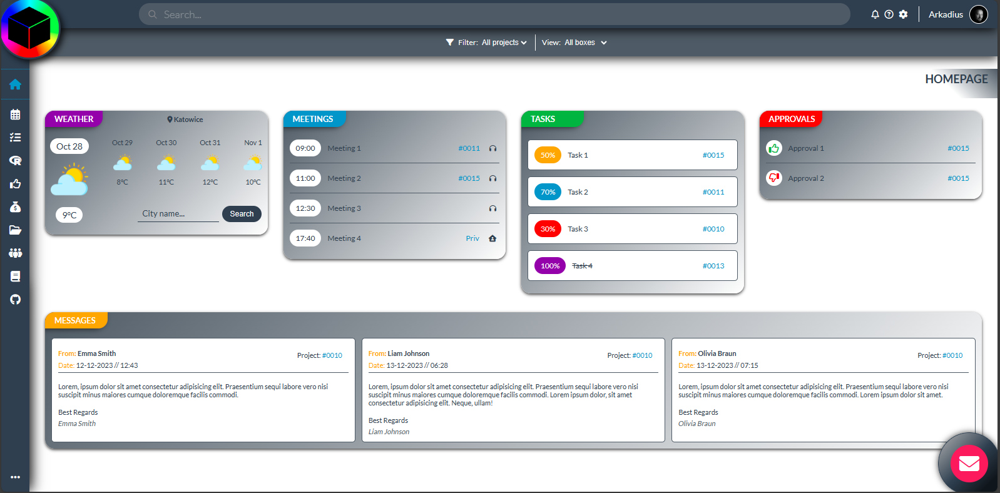
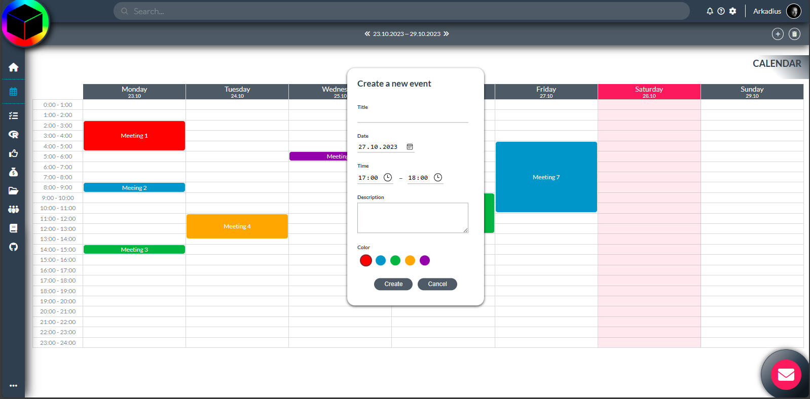
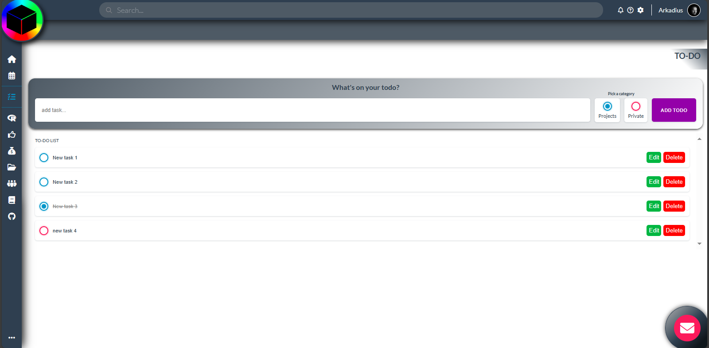
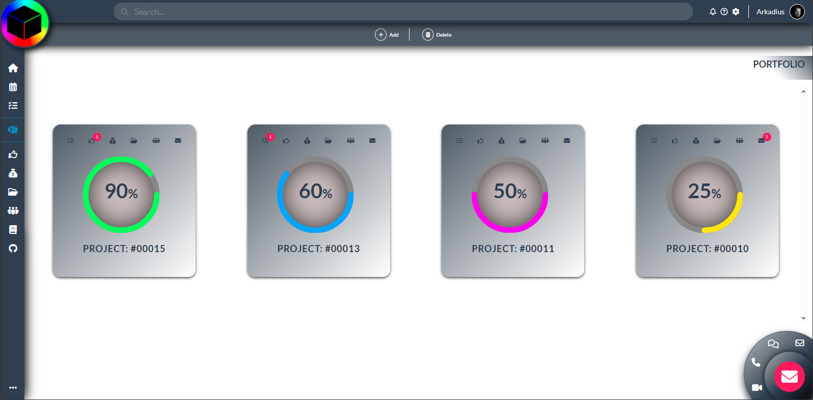
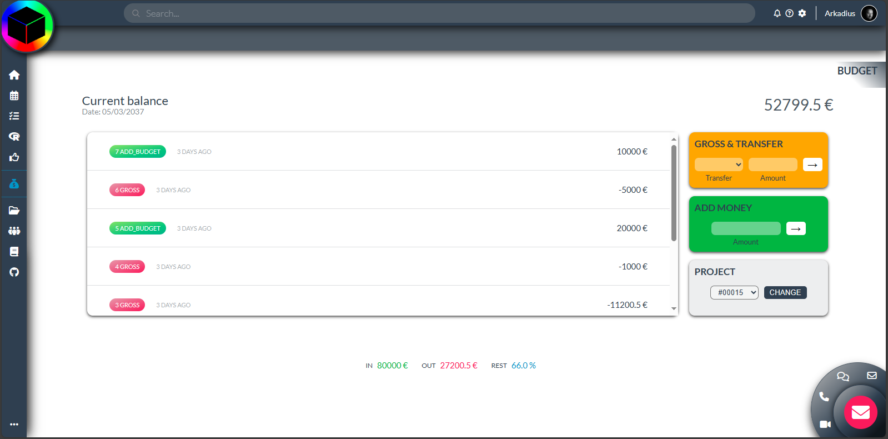

# PM-Box 

---

On a start page, please click in logo image and enter data below:

LOGIN: **Arkadius**

PIN: **12345**

---

[https://arkadius-wd.github.io/PM-Box/](https://arkadius-wd.github.io/PM-Box/dist/)

PM-Box Apple built with Vanilla JS. Styling with SASS.

[https://arkadius-wd.github.io/PM-Box/](https://arkadius-wd.github.io/PM-Box/dist/)

## Main technologies

